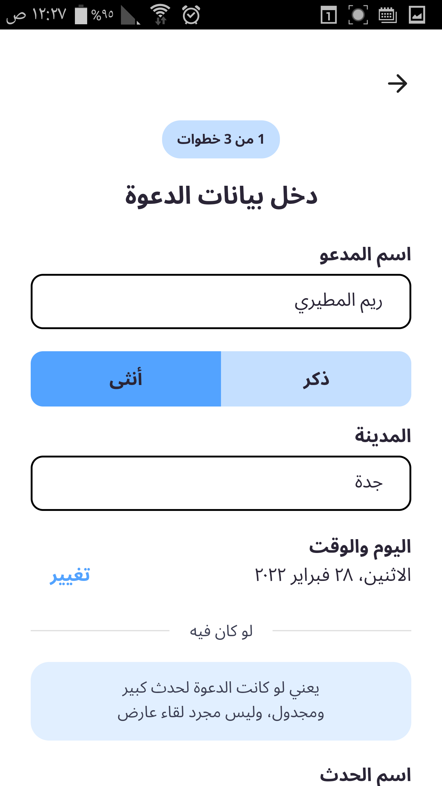
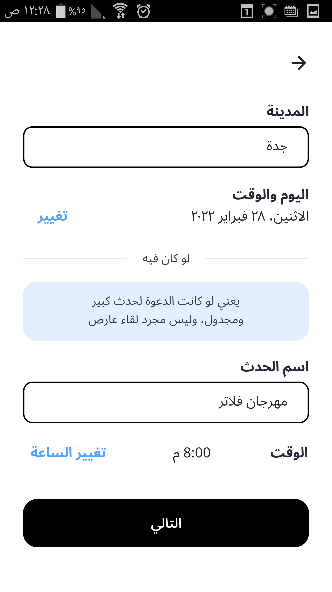
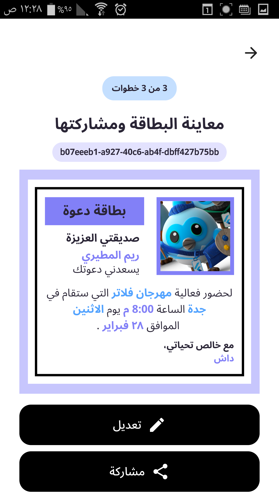
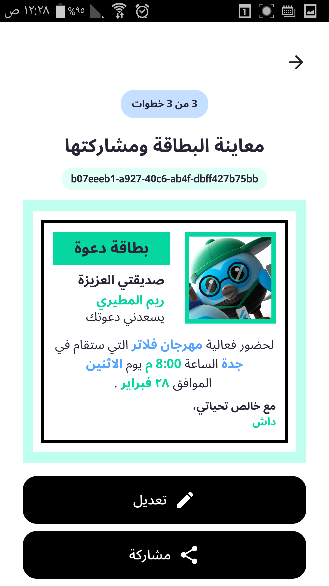
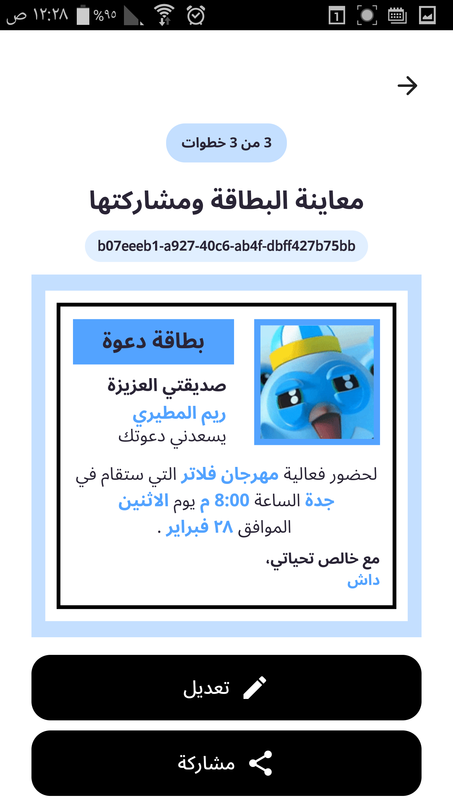
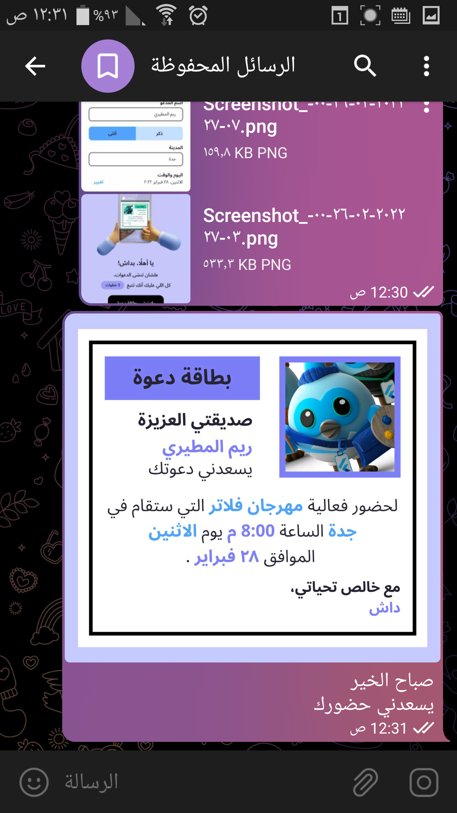

  
  
  
  <h3 align="center">Invitation Generator</h3>

  

    project to help Dash (the mascot of Flutter framework) in creating and sharing invitations with her friends :purple_heart:.
     
    <b>Contains</b>: converting widgets to an image with high resolution, besides localisation with two languages supported (Arabic & English).
     
    <b>Uses</b>: Riverpod as a state management solution.
     
    <em>(Submited as a part of Flutter Festival Challenge in KSA)</em>
     
    <a href="https://twitter.com/ReemNawaf">Twitter</a>
    ·
    <a href="https://www.linkedin.com/in/reemnawaf/">LinkedIn</a>
  

## Table of contents
- [To Start](#to-start)
- [screenshots](#screenshots)
- [What Next?](#what-next)
- [Creator](#creators)

## To Start
This is a normal flutter app. You should follow the instructions in the [official documentation](https://flutter.io/docs/get-started/install).

## Screenshots

  

    
    
    
  

   
  

    
    
    
  

   
  

    
    
    
  

   
  

    
    
    
  

  

## What next?
* I might add a feature to let the user add Google Map locations, convert the location to QR code, and add the QR code to the card.
* or creating new animated templates to be rendered as GIFs the card doesn't have to be a static png.

## Creators
<a href="https://github.com/ReemNawaf">*Reem Almutairi*</a>

Enjoy :white_heart:☕:brain:
